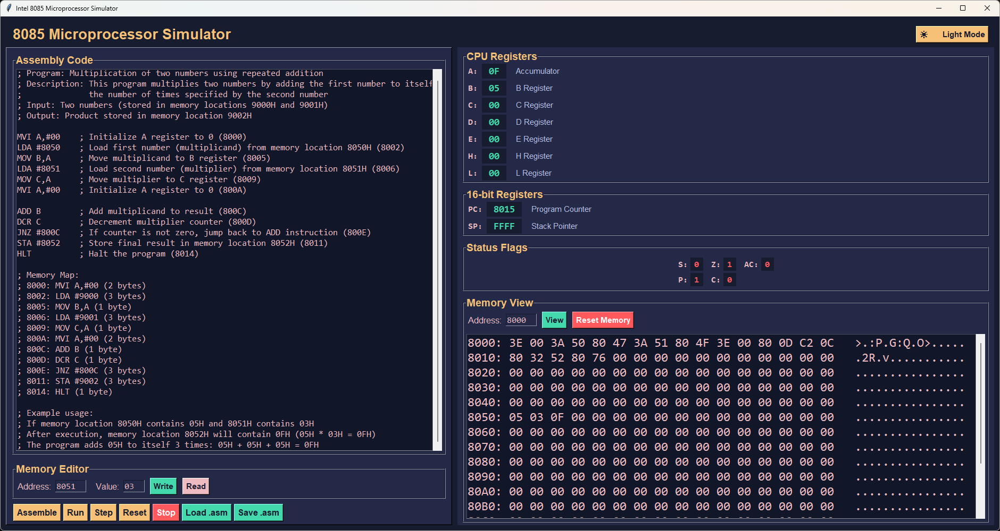

# Intel 8085 Microprocessor Simulator

A Python-based simulator for the Intel 8085 microprocessor with a graphical user interface. This simulator allows you to write, assemble, and execute 8085 assembly code while visualizing the CPU state, memory contents, and program execution. **Now with comprehensive AI-powered features!**

> **Note:** This project is currently under active development. Features and functionality may change as development progresses.

## Features

- Full 8085 instruction set support
- Real-time CPU state visualization
- Memory viewer and editor
- Assembly code editor with syntax highlighting
- Step-by-step execution
- Breakpoint support
- File I/O for assembly code
- **🤖 Comprehensive AI-Powered Features** - 11 different AI capabilities
- **🌙 Dark/Light Theme Toggle** - Modern UI with theme switching
- Comprehensive logging

## AI-Powered Features

The simulator now includes a comprehensive suite of AI-powered features to enhance your learning and development experience:

### **🤖 Available AI Features**

1. **📚 Code Explanation** - Get intelligent explanations of your assembly code
2. **⚡ Code Optimization** - Receive optimization suggestions and improvements
3. **🐛 Debug Assistant** - AI-powered debugging help and error analysis
4. **📖 Documentation Generator** - Automatic documentation creation
5. **📝 Quiz Generator** - Generate educational quizzes from your code
6. **🎯 Code Completion** - Get suggestions for next instructions
7. **🔄 Code Translation** - Translate to other architectures
8. **📊 Performance Analysis** - Analyze code performance and bottlenecks
9. **🎓 Learning Path Generator** - Personalized learning paths
10. **🔧 Code Review** - AI-powered code review and best practices
11. **📈 Algorithm Visualization** - Visual descriptions of algorithms

### **🚀 How to Use AI Features**

#### **Method 1: Menu Bar**
- Click on "AI Features" in the menu bar
- Select any AI feature from the dropdown menu
- Follow the prompts to provide additional information if needed

#### **Method 2: Quick Access**
- Use the "🤖 Explain" button in the control panel for quick code explanation

### **📋 Feature Details**

#### **1. Code Explanation**
- **What it does**: Provides detailed explanations of 8085 assembly code
- **Input**: Assembly code from the editor
- **Output**: Structured explanation with program overview, instruction breakdown, and educational notes

#### **2. Code Optimization**
- **What it does**: Analyzes code and suggests performance improvements
- **Input**: Assembly code from the editor
- **Output**: Optimization suggestions with code examples and explanations

#### **3. Debug Assistant**
- **What it does**: Helps identify and fix issues in assembly code
- **Input**: Assembly code + optional error message
- **Output**: Error analysis, debugging guide, and corrected code suggestions

#### **4. Documentation Generator**
- **What it does**: Creates comprehensive documentation for your code
- **Input**: Assembly code from the editor
- **Output**: Detailed documentation including function description, I/O specs, and usage examples

#### **5. Quiz Generator**
- **What it does**: Creates educational quizzes based on your code
- **Input**: Assembly code + difficulty level (beginner/intermediate/advanced)
- **Output**: Multiple choice, fill-in-the-blank, and true/false questions with explanations

#### **6. Code Completion**
- **What it does**: Suggests the next logical instruction
- **Input**: Assembly code + optional context
- **Output**: Multiple suggestions with reasoning and best practices

#### **7. Code Translation**
- **What it does**: Translates 8085 code to other architectures
- **Input**: Assembly code + target architecture (x86, ARM, MIPS, Z80, 6502)
- **Output**: Equivalent code with architecture-specific notes and differences

#### **8. Performance Analysis**
- **What it does**: Analyzes code performance characteristics
- **Input**: Assembly code from the editor
- **Output**: Execution time analysis, memory usage, bottleneck identification, and optimization suggestions

#### **9. Learning Path Generator**
- **What it does**: Creates personalized learning paths
- **Input**: User level + topics of interest
- **Output**: Structured learning sequence with exercises, milestones, and time estimates

#### **10. Code Review**
- **What it does**: Reviews code for quality and best practices
- **Input**: Assembly code from the editor
- **Output**: Code quality assessment, improvement suggestions, and best practices evaluation

#### **11. Algorithm Visualization**
- **What it does**: Creates visual descriptions of algorithms
- **Input**: Assembly code from the editor
- **Output**: Step-by-step visualization with data flow diagrams and state transitions

### **🔧 Setup Required**
To use the AI features, you need a Groq API key:

1. **Get API Key**: Sign up at [Groq Console](https://console.groq.com/)
2. **Set Environment Variable**: Add to your `.env` file:
   ```
   GROQ_API_KEY=your_api_key_here
   ```
3. **Install Dependencies**: 
   ```bash
   pip install requests python-dotenv
   ```

### **💡 Example Usage**

#### **Code Explanation Example**
```assembly
MVI A, #05      ; Load 05H into A
MVI B, #03      ; Load 03H into B
ADD B           ; A = A + B (A = 08H)
STA #9000       ; Store result at 9000H
HLT             ; Halt
```

The AI will explain:
- What each instruction does
- How data flows through registers
- The overall purpose of the program
- Important 8085 concepts used

#### **Code Optimization Example**
The AI will suggest:
- Performance improvements
- Memory usage optimizations
- Alternative approaches
- Best practices

#### **Debug Assistant Example**
If you have an error, the AI will:
- Analyze the error and common causes
- Provide step-by-step debugging guide
- Suggest corrected code
- Offer prevention tips

## Output Screenshots

The Interface Output:
<p align="center">
  
</p>

The Terminal Log Output:
<p align="center">
  
</p>

The simulator provides a visual interface with several key components:

1. **Code Editor**: Located at the top-left, where you can write and edit your assembly code
2. **Memory Viewer**: Shows the contents of memory locations in hexadecimal format
3. **Register Display**: Shows the current state of all CPU registers (A, B, C, D, E, H, L, SP, PC)
4. **Status Flags**: Displays the state of all CPU flags (S, Z, AC, P, C)
5. **Control Panel**: Contains buttons for Run, Step, Stop, Reset, Load/Save, and **🤖 Explain**
6. **AI Features Menu**: Access to all 11 AI-powered features
7. **Terminal**: Shows all kinds of log about the system in real time
8. **Theme Toggle**: Switch between dark and light modes for better user experience

To view the output:
1. Load or write your assembly code
2. Click "Assemble" to compile the code
3. Use the Run or Step buttons to execute the program
4. Use AI features from the menu or quick access buttons
5. The Memory Viewer and Register Display will update in real-time

## Project Structure

```
Intel-8085-Microprocessor-Simulator
├── Src/
│   ├── __init__.py
│   ├── Core/
│   │   ├── __init__.py
│   │   ├── Memory.py
│   │   ├── ALU.py
│   │   ├── CPU.py
│   │   └── Assembler.py
│   ├── Interface/
│   │   ├── __init__.py
│   │   └── SimulatorGUI.py
│   └── Utils/
│       ├── __init__.py
│       ├── Logger.py
│       └── AIFeatures.py          # NEW: Comprehensive AI features system
├── AssemblyPrograms/
│   ├── addition_example.asm
│   ├── subtraction_example.asm
│   ├── multiplication_example.asm
│   ├── divide_example.asm
│   └── More...
├── run.py
├── INSTRUCTIONS.md                 # Complete instruction reference
└── 8085_simulator.log
```

## Requirements

- Python 3.6 or higher
- tkinter (usually comes with Python)
- **requests** (for AI features)
- **python-dotenv** (for environment variable management)

## Installation

1. Clone the repository:
```bash
git clone https://github.com/THAMIZH-ARASU/Intel-8085-Microprocessor-Simulator.git
cd simple8085
```

2. Install required dependencies:
```bash
pip install requests python-dotenv
```

3. Set up your API key (optional, for AI features):
   - Create a `.env` file in the project root
   - Add: `GROQ_API_KEY=your_api_key_here`

4. Run the simulator:
```bash
python run.py
```

## Usage

1. Write your 8085 assembly code in the code editor
2. Click "Assemble" to convert the code to machine code
3. Use the following controls to execute your program:
   - **Run**: Execute the program continuously
   - **Step**: Execute one instruction at a time
   - **Stop**: Halt program execution
   - **Reset**: Reset the CPU to initial state
   - **Load/Save**: Load or save assembly code files
   - **🤖 Explain**: Quick access to AI code explanation
   - **AI Features Menu**: Access to all 11 AI features

## AI Features Usage Guide

### **🎯 Getting Started with AI Features**
1. **Get API Key**: Sign up at [Groq Console](https://console.groq.com/)
2. **Set Environment Variable**: Add to `.env` file:
   ```
   GROQ_API_KEY=your_api_key_here
   ```
3. **Use the Features**: Access via menu bar or quick access buttons

### **📖 What You'll Get from Each Feature**

#### **Code Explanation**
- **Structured Explanations**: Clear sections with headers and bullet points
- **Educational Focus**: Designed for learning 8085 assembly
- **Step-by-Step Breakdown**: Each instruction explained in detail
- **Concept Highlights**: Important 8085 concepts and techniques
- **Learning Tips**: Educational insights for better understanding

#### **Code Optimization**
- **Performance Analysis**: Identify bottlenecks and inefficiencies
- **Memory Optimization**: Suggestions for better memory usage
- **Code Size Reduction**: Ways to make code more compact
- **Alternative Approaches**: Different ways to achieve the same result
- **Best Practices**: Industry-standard recommendations

#### **Debug Assistant**
- **Error Analysis**: Detailed explanation of what went wrong
- **Common Causes**: Typical reasons for similar errors
- **Step-by-Step Guide**: Systematic approach to debugging
- **Corrected Code**: Working versions of problematic code
- **Prevention Tips**: How to avoid similar issues

#### **Documentation Generator**
- **Function Description**: Clear explanation of what the code does
- **Input/Output Specs**: What the code expects and produces
- **Memory Usage Analysis**: How much memory the code uses
- **Execution Flow**: Step-by-step description of program flow
- **Usage Examples**: Practical examples of how to use the code

#### **Quiz Generator**
- **Multiple Choice Questions**: Test understanding of concepts
- **Fill-in-the-Blank**: Practice with specific instructions
- **True/False Questions**: Test knowledge of facts
- **Step-by-Step Questions**: Test execution understanding
- **Difficulty Levels**: Beginner, intermediate, and advanced questions

#### **Code Completion**
- **Next Instruction Suggestions**: Logical next steps in code
- **Pattern Recognition**: Common programming patterns
- **Best Practices**: Industry-standard approaches
- **Register Considerations**: How to use registers effectively
- **Memory Usage Patterns**: Efficient memory management

#### **Code Translation**
- **Equivalent Code**: Same functionality in target architecture
- **Key Differences**: Important architectural differences
- **Optimization Opportunities**: Architecture-specific improvements
- **Portability Considerations**: How to make code more portable
- **Architecture Notes**: Specific considerations for target platform

#### **Performance Analysis**
- **Execution Time**: Estimated time for each instruction
- **Memory Usage**: How much memory the code uses
- **Bottleneck Identification**: Where performance can be improved
- **Optimization Suggestions**: Specific ways to improve performance
- **Resource Utilization**: How efficiently resources are used

#### **Learning Path Generator**
- **Structured Sequence**: Logical progression of topics
- **Practice Exercises**: Hands-on learning activities
- **Progressive Difficulty**: Gradually increasing complexity
- **Assessment Points**: Checkpoints to test understanding
- **Recommended Resources**: Additional learning materials

#### **Code Review**
- **Quality Assessment**: Overall code quality evaluation
- **Best Practices**: Industry-standard recommendations
- **Security Considerations**: Potential security issues
- **Maintainability**: How easy the code is to maintain
- **Style and Readability**: Code formatting and clarity

#### **Algorithm Visualization**
- **Step-by-Step Visualization**: Detailed execution flow
- **Data Flow Diagrams**: How data moves through the program
- **State Transitions**: How program state changes
- **Memory State Changes**: How memory is modified
- **Register Value Tracking**: How register values change

### **🔧 Troubleshooting AI Features**
- **API Key Missing**: Ensure `GROQ_API_KEY` is set in your `.env` file
- **Network Issues**: Check your internet connection
- **Rate Limits**: Groq has rate limits; wait if you hit them
- **Feature Not Working**: Check the logs for detailed error messages

## Memory Editor

The memory editor allows you to:
- Read byte values from specific memory addresses
- Write byte values to specific memory addresses
- View memory contents in the memory viewer

## Status Flags

The simulator displays the following CPU status flags:
- S (Sign): Set if result is negative
- Z (Zero): Set if result is zero
- AC (Auxiliary Carry): Set if there's a carry from bit 3 to bit 4
- P (Parity): Set if result has even parity
- C (Carry): Set if there's a carry from bit 7

## Technical Documentation

### Core Components

#### CPU (Central Processing Unit)
The CPU implementation (`Src/Core/CPU.py`) is the heart of the simulator, implementing the Intel 8085 microprocessor architecture:

- **Register Implementation**:
  - 8-bit registers (A, B, C, D, E, H, L)
  - 16-bit registers (PC, SP)
  - Status flags (S, Z, AC, P, C)
  - Register pairs (BC, DE, HL) for 16-bit operations

- **Instruction Set**:
  - Full implementation of 8085 instruction set
  - Data transfer instructions (MOV, MVI, LXI)
  - Arithmetic instructions (ADD, SUB, INR, DCR)
  - Logical instructions (ANA, ORA, XRA)
  - Branch instructions (JMP, CALL, RET)
  - Stack operations (PUSH, POP)

- **Implementation Techniques**:
  - Instruction decoding using opcode mapping
  - Flag management for arithmetic and logical operations
  - Memory-mapped I/O support
  - Interrupt handling system

#### Memory Management Unit
The Memory implementation (`Src/Core/Memory.py`) provides a 64KB addressable space:

- **Features**:
  - 64KB (0x0000-0xFFFF) addressable memory
  - Byte and word (16-bit) read/write operations
  - Memory breakpoint support
  - Memory write callback system for GUI updates
  - Program loading functionality

- **Implementation Details**:
  - Little-endian byte ordering for 16-bit operations
  - Memory access validation
  - Breakpoint tracking system
  - Memory write notification system

#### ALU (Arithmetic Logic Unit)
The ALU implementation (`Src/Core/ALU.py`) handles all arithmetic and logical operations:

- **Operations**:
  - 8-bit addition with carry
  - 8-bit subtraction with borrow
  - Logical AND, OR, XOR operations
  - Flag generation for all operations

- **Flag Management**:
  - Sign (S): Set if result is negative
  - Zero (Z): Set if result is zero
  - Auxiliary Carry (AC): Set if carry from bit 3 to 4
  - Parity (P): Set if result has even parity
  - Carry (C): Set if operation produces carry/borrow

### Interface Components

#### GUI Implementation
The GUI (`Src/Interface/SimulatorGUI.py`) provides a modern, user-friendly interface:

- **Features**:
  - Code editor with syntax highlighting
  - Real-time CPU state visualization
  - Memory viewer and editor
  - Program execution controls
  - File I/O operations
  - **🤖 Comprehensive AI Features** - 11 different AI capabilities
  - **🌙 Theme Toggle** - Dark/Light mode switching

- **Implementation Details**:
  - Tkinter-based interface
  - Multi-threaded execution
  - Real-time state updates
  - Memory visualization
  - Error handling and user feedback
  - AI integration with threading support

### Utility Components

#### Logger
The Logger (`Src/Utils/Logger.py`) provides comprehensive logging:

- **Features**:
  - File and console logging
  - Timestamp-based logging
  - Multiple log levels (INFO, DEBUG, ERROR)
  - Persistent log storage

#### AI Features System
The AI Features (`Src/Utils/AIFeatures.py`) provides comprehensive AI capabilities:

- **Features**:
  - Modular design with 11 different AI features
  - Groq API integration for all AI capabilities
  - Structured, educational responses
  - Comprehensive error handling
  - Connection testing and validation
  - Detailed logging for troubleshooting

- **Implementation Details**:
  - Thread-safe API calls
  - Structured prompt engineering
  - Response formatting and validation
  - Error categorization and user-friendly messages
  - Modular architecture for easy extension

### Potential Enhancements

#### Core Components
1. **CPU Enhancements**:
   - Add support for undocumented instructions
   - Implement cycle-accurate timing
   - Add hardware interrupt simulation
   - Implement DMA controller simulation

2. **Memory Enhancements**:
   - Add memory protection mechanisms
   - Implement memory-mapped I/O devices
   - Add memory access patterns analysis
   - Support for ROM/EEPROM simulation

3. **ALU Enhancements**:
   - Add BCD arithmetic support
   - Implement decimal adjust operations
   - Add bit manipulation instructions
   - Support for extended arithmetic operations

#### Interface Enhancements
1. **GUI Improvements**:
   - Add dark/light theme support ✅ **COMPLETED**
   - Implement code debugging features
   - Add memory visualization improvements
   - Support for multiple code views
   - Add performance profiling tools

2. **User Experience**:
   - Add keyboard shortcuts
   - Implement code templates
   - Add program execution history
   - Support for multiple breakpoints
   - Add program execution speed control

#### AI Features
1. **Enhanced Explanations**:
   - Add visual diagrams for data flow
   - Implement step-by-step animation
   - Add code optimization suggestions
   - Support for multiple explanation styles

2. **Educational Tools**:
   - Add interactive tutorials
   - Implement learning progress tracking
   - Add quiz generation from code
   - Support for custom learning paths

3. **Advanced AI Features**:
   - Add code generation capabilities
   - Implement automated testing suggestions
   - Add performance benchmarking
   - Support for code refactoring
   - Add architecture comparison tools

#### Utility Enhancements
1. **Logging System**:
   - Add log rotation
   - Implement log filtering
   - Add performance metrics logging
   - Support for remote logging
   - Add log analysis tools

2. **Development Tools**:
   - Add unit testing framework
   - Implement code coverage tools
   - Add performance benchmarking
   - Support for automated testing
   - Add documentation generation

#### New Features
1. **Educational Tools**:
   - Add interactive tutorials
   - Implement step-by-step execution guides
   - Add visual instruction explanations
   - Support for program examples
   - Add learning exercises

2. **Advanced Features**:
   - Add support for external devices
   - Implement network simulation
   - Add real-time debugging
   - Support for program optimization
   - Add performance analysis tools

## Contributing

Contributions are welcome! Please feel free to submit a Pull Request.

## License

This project is licensed under the MIT License - see the LICENSE file for details. 
